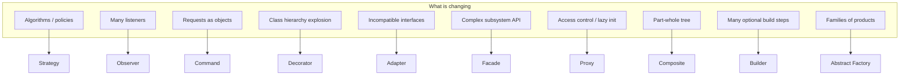

# Map of content — design patterns

Hub note for this vault. Deep notes live as **`{Pattern}.md`** next to each folder’s `*.java` demos; each note includes a **trimmed Java snapshot** plus run instructions.

**Quick cram:** [[00-Quick-Revision]] (alias: open [[00-Quick-Revision.md]] if wikilink differs by settings).

**Study path:** [[00-Study-Sequence]] — order to learn + what you can skim.

## By category

### Creational

| Pattern | Note |
|---------|------|
| Singleton | [[creational/singleton/Singleton\|Singleton]] |
| Factory Method | [[creational/factory-method/FactoryMethod\|Factory Method]] |
| Abstract Factory | [[creational/abstract-factory/AbstractFactory\|Abstract Factory]] |
| Builder | [[creational/builder/Builder\|Builder]] |
| Prototype | [[creational/prototype/Prototype\|Prototype]] |

### Structural

| Pattern | Note |
|---------|------|
| Adapter | [[structural/adapter/Adapter\|Adapter]] |
| Decorator | [[structural/decorator/Decorator\|Decorator]] |
| Facade | [[structural/facade/Facade\|Facade]] |
| Proxy | [[structural/proxy/Proxy\|Proxy]] |
| Composite | [[structural/composite/Composite\|Composite]] |
| Bridge | [[structural/bridge/Bridge\|Bridge]] |
| Flyweight | [[structural/flyweight/Flyweight\|Flyweight]] |

### Behavioral

| Pattern | Note |
|---------|------|
| Strategy | [[behavioral/strategy/Strategy\|Strategy]] |
| Observer | [[behavioral/observer/Observer\|Observer]] |
| Command | [[behavioral/command/Command\|Command]] |
| Template Method | [[behavioral/template-method/TemplateMethod\|Template Method]] |
| State | [[behavioral/state/State\|State]] |
| Chain of Responsibility | [[behavioral/chain-of-responsibility/ChainOfResponsibility\|Chain of Responsibility]] |
| Iterator | [[behavioral/iterator/Iterator\|Iterator]] |
| Mediator | [[behavioral/mediator/Mediator\|Mediator]] |
| Memento | [[behavioral/memento/Memento\|Memento]] |
| Visitor | [[behavioral/visitor/Visitor\|Visitor]] |

## Decision flow (high level)

## Plain markdown links (if wikilinks are off)

- [Singleton](creational/singleton/Singleton.md) · [Factory Method](creational/factory-method/FactoryMethod.md) · [Abstract Factory](creational/abstract-factory/AbstractFactory.md) · [Builder](creational/builder/Builder.md) · [Prototype](creational/prototype/Prototype.md)
- [Adapter](structural/adapter/Adapter.md) · [Decorator](structural/decorator/Decorator.md) · [Facade](structural/facade/Facade.md) · [Proxy](structural/proxy/Proxy.md) · [Composite](structural/composite/Composite.md) · [Bridge](structural/bridge/Bridge.md) · [Flyweight](structural/flyweight/Flyweight.md)
- [Strategy](behavioral/strategy/Strategy.md) · [Observer](behavioral/observer/Observer.md) · [Command](behavioral/command/Command.md) · [Template Method](behavioral/template-method/TemplateMethod.md) · [State](behavioral/state/State.md) · [Chain of Responsibility](behavioral/chain-of-responsibility/ChainOfResponsibility.md) · [Iterator](behavioral/iterator/Iterator.md) · [Mediator](behavioral/mediator/Mediator.md) · [Memento](behavioral/memento/Memento.md) · [Visitor](behavioral/visitor/Visitor.md)
